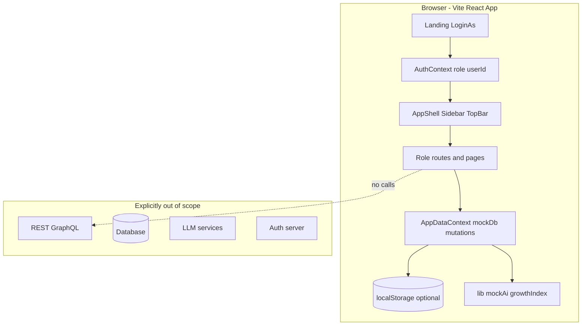
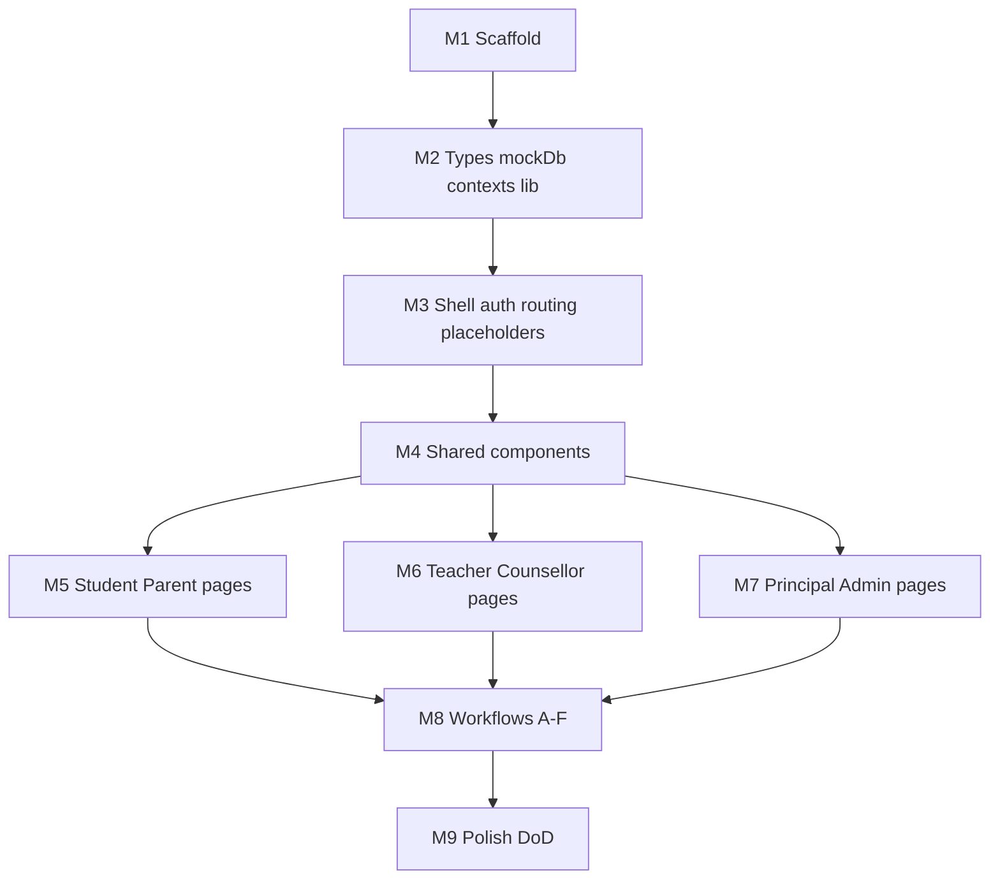

# Student 360° Growth Platform — Implementation Roadmap (POC)

## 1. Executive Summary

The repository today is **specification-only**: eight markdown files at the project root ([00-project-overview.md](c:\Users\shris\Desktop\school360_poc\00-project-overview.md) through [06-components-and-design-system.md](c:\Users\shris\Desktop\school360_poc\06-components-and-design-system.md), plus [build_plan.md](c:\Users\shris\Desktop\school360_poc\build_plan.md)). There is **no** `package.json`, `src/`, git history, or deployed artifact.

Per your confirmed scope (**POC only**), success means a single demoable Vite app: fake login, role switching, realistic mock data, charts, cross-role state updates, confidentiality rules for counselling, and templated “AI-assisted” copy—not production auth, APIs, PostgreSQL, or model calls.

**Recommended first task after approval:** Milestone 1 — scaffold Vite + React + TS + Tailwind + shadcn + React Router per [01-tech-stack.md](c:\Users\shris\Desktop\school360_poc\01-tech-stack.md).

**Doc hygiene note:** [00-project-overview.md](c:\Users\shris\Desktop\school360_poc\00-project-overview.md) references `07-build-plan.md`; the actual file is [build_plan.md](c:\Users\shris\Desktop\school360_poc\build_plan.md). Optionally rename or add a stub link when implementing (non-blocking).

---

## 2. Documentation Summary

| Doc | Purpose |
|-----|---------|
| [00-project-overview.md](c:\Users\shris\Desktop\school360_poc\00-project-overview.md) | Frontend-only POC; non-goals (no backend/auth/AI/uploads); “one profile, many views” narrative |
| [01-tech-stack.md](c:\Users\shris\Desktop\school360_poc\01-tech-stack.md) | Vite, React, TS, React Router, Tailwind, shadcn, Recharts, Context state, `mockAi.ts`, folder layout |
| [02-information-architecture.md](c:\Users\shris\Desktop\school360_poc\02-information-architecture.md) | Landing “Login as”, routes for 6 roles (~30 routes), shared dialogs/drawer |
| [03-mock-data-model.md](c:\Users\shris\Desktop\school360_poc\03-mock-data-model.md) | Entity types, `mockDb` seed, `computeGrowthIndex()` weights |
| [04-role-dashboards.md](c:\Users\shris\Desktop\school360_poc\04-role-dashboards.md) | Widget-level specs per role dashboard |
| [05-key-screens-and-workflows.md](c:\Users\shris\Desktop\school360_poc\05-key-screens-and-workflows.md) | Workflows A–F + 13-section Student 360° Report |
| [06-components-and-design-system.md](c:\Users\shris\Desktop\school360_poc\06-components-and-design-system.md) | Visual tone, shared components, layout, forms |
| [build_plan.md](c:\Users\shris\Desktop\school360_poc\build_plan.md) | Nine milestones + definition of done checklist |

**Product vision:** Unified student development (academics, skills, counselling, career, portfolio, institutional analytics) shown as **one continuous profile** with role-appropriate visibility.

**Business goal:** Stakeholder demo (leadership, investors, pilot schools)—experience over production logic.

---

## 3. Architecture Understanding

**Data flow:** Single [`mockDb`](c:\Users\shris\Desktop\school360_poc\03-mock-data-model.md) loaded once; all roles read/write the same in-memory store (optional `localStorage` sync). **No network layer.**

**Security model (demo):** Role-based **UI filtering** only—counsellor `restrictedNotes` hidden from student/parent/teacher views; teachers may see referral flags, not case notes ([04-role-dashboards.md](c:\Users\shris\Desktop\school360_poc\04-role-dashboards.md), Workflow C).

**“AI” architecture:** Template strings in `lib/mockAi.ts` + `AiBadge`; interpolation with student name/scores—no API keys, no env vars.

---

## 4. Gap Analysis (Docs vs Codebase)

| Area | Doc expectation | Current codebase | Gap |
|------|-----------------|------------------|-----|
| Project scaffold | Vite + deps | None | Missing |
| Types + mockDb | ~15–20 students, full entity graph | None | Missing |
| Contexts | Auth + AppData | None | Missing |
| Routing | ~30 routes + placeholders | None | Missing |
| Layout | AppShell, nav config, RoleSwitcher | None | Missing |
| Shared UI | 10+ shared components + shadcn | None | Missing |
| Student/Parent pages | 8 + 6 routes | None | Missing |
| Teacher/Counsellor | Class roster, cases, confidentiality | None | Missing |
| Principal/Admin | KPIs, departments, light admin | None | Missing |
| Workflows A–F | Cross-role state consistency | None | Missing |
| 360° Report | 13 sections + print | None | Missing |
| Definition of done | [build_plan.md](c:\Users\shris\Desktop\school360_poc\build_plan.md) checklist | 0/6 items | Missing |

**Not gaps (intentional non-goals):** Real authentication, backend APIs, database, file storage, payments, multi-tenant, email/SMS, PDF service, real AI/ML.

**Architecture mismatches:** None in code—only a **naming mismatch** (`07-build-plan.md` vs `build_plan.md`).

**Technical debt:** N/A pre-implementation; during build, avoid duplicate mock logic (centralize risk/at-risk derivation in `lib/` helpers).

---

## 5. Project Status (Completion %)

| Layer | % | Notes |
|-------|---|--------|
| **Overall POC** | **~5%** | Specs complete; zero runnable app |
| **Frontend (UI/routes)** | **0%** | All pages/components absent |
| **Mock data layer** | **0%** | Types + seed not created |
| **Simulated AI** | **0%** | `mockAi.ts` not created |
| **Backend** | **N/A (by design)** | Not in POC scope |
| **Database** | **N/A (by design)** | Replaced by `mockDb` + optional localStorage |
| **Infrastructure** | **0%** | No repo tooling, CI, or deploy config (optional later: static host only) |

---

## 6. Dependency Graph

**Critical path:** M1 → M2 → M3 → M4 → (role pages) → M8 → M9.

**Parallelizable after M4:** Student/Parent (M5) vs Teacher/Counsellor (M6) vs Principal/Admin (M7).

---

## 7. Feature Priority Matrix

| Priority | Feature | Complexity | Depends on |
|----------|---------|------------|------------|
| P0 | Scaffold + theme | S | — |
| P0 | Types + mockDb + contexts | M | M1 |
| P0 | Login + AppShell + all route stubs | M | M2 |
| P0 | Shared charts/badges/gauge/drawer | M | M3 |
| P1 | Student dashboard + sub-routes | L | M4 |
| P1 | Parent dashboard + sub-routes | M | M4 |
| P1 | Teacher dashboard + class/student/interventions | L | M4 |
| P1 | Counsellor cases + confidentiality UI | M | M4 |
| P2 | Principal analytics views | M | M4 |
| P3 | Admin tables | S | M4 |
| P1 | Workflows A–E (F lightweight) | L | Role pages |
| P2 | 360° Report 13 sections + print | M | M5, growthIndex |
| P2 | Polish: AiBadge everywhere, responsive, empty states | M | M8 |

Complexity: **S** = small (hours), **M** = medium (1–2 days), **L** = large (2–4 days) for a single developer familiar with the stack.

---

## 8. Feature Checklist

Legend: ✅ Completed | 🟡 Partial | ❌ Missing

### Foundation
| Feature | Status | Complexity | Files (planned) |
|---------|--------|------------|-----------------|
| Vite + TS + Tailwind + shadcn | ❌ | S | `package.json`, `vite.config.ts`, `tailwind.config.ts`, `src/main.tsx` |
| Folder structure | ❌ | S | `src/data`, `context`, `routes`, `components`, `lib`, `types` |
| Entity TypeScript types | ❌ | M | `src/types/*.ts` or `src/types/index.ts` |
| mockDb seed (~15–20 students) | ❌ | L | `src/data/mockDb.ts` |
| AppDataContext + mutations | ❌ | M | `src/context/AppDataContext.tsx` |
| AuthContext + fake login | ❌ | S | `src/context/AuthContext.tsx` |
| growthIndex helper | ❌ | M | `src/lib/growthIndex.ts` |
| mockAi templates | ❌ | M | `src/lib/mockAi.ts` |
| navConfig per role | ❌ | S | `src/lib/navConfig.ts` |

### Layout & auth UX
| Feature | Status | Complexity | Files |
|---------|--------|------------|-------|
| Landing “Login as” + personas | ❌ | M | `src/routes/Landing.tsx` |
| AppShell, Sidebar, TopBar | ❌ | M | `src/components/layout/*` |
| RoleSwitcher | ❌ | S | `src/components/layout/RoleSwitcher.tsx` |
| Mock notifications dropdown | ❌ | S | TopBar |
| Route map (all roles) | ❌ | L | `src/App.tsx` or `src/routes/index.tsx`, placeholder pages |

### Shared components
| Feature | Status | Files |
|---------|--------|-------|
| StatCard, TrendChart, SkillRadar | ❌ | `src/components/shared/*` |
| RiskBadge, GrowthIndexGauge, Timeline, AiBadge | ❌ | same |
| StudentProfileDrawer | ❌ | `src/components/shared/StudentProfileDrawer.tsx` |
| EmptyState (+ optional LoadingState) | ❌ | shared |
| Form dialogs (goals, observation, appointment, intervention, portfolio, case, marks/attendance) | ❌ | `src/components/dialogs/*` or colocated |

### Student (`/student/*`)
| Route / feature | Status | Complexity |
|-----------------|--------|------------|
| Dashboard home | ❌ | M |
| academics, skills, goals, portfolio, career | ❌ | M each |
| counselling, messages | ❌ | S–M |
| 360° Report (13 sections) | ❌ | L |
| Career mock quiz (Workflow D) | ❌ | M |

### Parent (`/parent/*`)
| Feature | Status |
|---------|--------|
| Dashboard + child selector | ❌ |
| academics, attendance, feedback, meetings | ❌ |
| Approve/decline consent (local state) | ❌ |
| Report (parent view) | ❌ |

### Teacher (`/teacher/*`)
| Feature | Status |
|---------|--------|
| Dashboard + support table + RiskBadge | ❌ |
| `/classes/:classId` roster, attendance/marks entry | ❌ |
| `/students/:studentId` deep-dive + observation | ❌ |
| interventions list + create (Workflow A) | ❌ |
| analytics | ❌ |
| Portfolio verification (Workflow E) | ❌ |
| Raise concern → case (Workflow C) | ❌ |

### Counsellor (`/counsellor/*`)
| Feature | Status |
|---------|--------|
| Dashboard appointments + case priority | ❌ |
| cases list + `/cases/:caseId` restricted notes UI | ❌ |
| appointments | ❌ |
| New referral dialog | ❌ |

### Principal (`/principal/*`)
| Feature | Status |
|---------|--------|
| KPI dashboard | ❌ |
| departments, risk, engagement | ❌ |
| Workflow B/F drill-down | ❌ |

### Admin (`/admin`)
| Feature | Status |
|---------|--------|
| Institutions/users/permissions tables | ❌ (P3) |

### Cross-cutting workflows
| Workflow | Status |
|----------|--------|
| A Academic intervention | ❌ |
| B Attendance support | ❌ |
| C Counselling referral + confidentiality | ❌ |
| D Career planning | ❌ |
| E Portfolio verification | ❌ |
| F Institution review drill-down | ❌ |

### Definition of done ([build_plan.md](c:\Users\shris\Desktop\school360_poc\build_plan.md))
| Criterion | Status |
|-----------|--------|
| Login as 6 persona types | ❌ |
| RoleSwitcher without losing state | ❌ |
| All 6 dashboards with charts | ❌ |
| Workflows A–E clickable | ❌ |
| Report + print | ❌ |
| No console errors; no network calls | ❌ |

---

## 9. Implementation Order (Phases)

Aligned with [build_plan.md](c:\Users\shris\Desktop\school360_poc\build_plan.md) milestones:

**Phase 1 — Scaffold (M1)**  
Vite project, dependencies, Tailwind theme (indigo primary, risk semantics), base `src/` tree.

**Phase 2 — Data layer (M2)**  
Types, `mockDb`, `AppDataContext`, `AuthContext`, `growthIndex.ts`, `mockAi.ts`, optional localStorage hydration.

**Phase 3 — Shell & routing (M3)**  
Landing, protected layout wrapper, full route table with minimal placeholder components (“Coming soon” only where needed temporarily—prefer real stubs with titles).

**Phase 4 — Shared components (M4)**  
All shared visual components + shadcn primitives; `StudentProfileDrawer` wired to mock data.

**Phase 5 — Role UIs (M5–M7)**  
Student/Parent first (demo story for child Aarav-style persona), then Teacher/Counsellor (workflows), then Principal; Admin last.

**Phase 6 — Workflows (M8)**  
Wire cross-role updates: interventions → parent alert → optional student goal; counselling case creation; portfolio verify; career quiz updates interests.

**Phase 7 — Polish & verification (M9)**  
AiBadge consistency, counselling leak audit, print CSS for report, tablet responsive pass, empty states, `npm run build` clean.

**Phase 8 — Testing (light, POC-appropriate)**  
Manual demo script per workflow; optional Vitest for `computeGrowthIndex` pure function only if time permits (not required by specs).

**Phase 9 — Deployment (optional)**  
Static build to Vercel/Netlify/GitHub Pages—no env vars required.

---

## 10. File-Level Execution Plan (by milestone)

### M1 — Create
- `package.json`, `vite.config.ts`, `tsconfig.json`, `index.html`
- `src/main.tsx`, `src/App.tsx`, `src/index.css`
- `components.json` (shadcn), initial `src/components/ui/*`
- **Outcome:** `npm run dev` serves blank themed app

### M2 — Create
- `src/types/index.ts` (all interfaces from [03-mock-data-model.md](c:\Users\shris\Desktop\school360_poc\03-mock-data-model.md))
- `src/data/mockDb.ts` (seed arrays + export)
- `src/context/AppDataContext.tsx`, `AuthContext.tsx`
- `src/lib/growthIndex.ts`, `mockAi.ts`, `utils.ts`
- **Modify:** `src/main.tsx` — wrap providers
- **Outcome:** Context exposes data; growth index computable in dev console

### M3 — Create
- `src/routes/Landing.tsx`
- `src/components/layout/AppShell.tsx`, `Sidebar.tsx`, `TopBar.tsx`, `RoleSwitcher.tsx`
- `src/lib/navConfig.ts`
- `src/routes/**` — one file per route group (student, parent, …) with placeholder pages
- **Modify:** `src/App.tsx` — React Router v6 routes + auth guard redirect to `/`
- **Outcome:** Login → dashboard stub per role; switch role works

### M4 — Create
- `src/components/shared/StatCard.tsx`, `TrendChart.tsx`, `SkillRadar.tsx`, `RiskBadge.tsx`, `GrowthIndexGauge.tsx`, `Timeline.tsx`, `AiBadge.tsx`, `StudentProfileDrawer.tsx`, `EmptyState.tsx`
- **Outcome:** Storybook-like reuse ready (no Storybook required)

### M5 — Create/modify
- `src/routes/student/*.tsx` (8 routes)
- `src/routes/parent/*.tsx` (6 routes)
- Dialogs: `NewGoalDialog`, portfolio add, career quiz component
- **Outcome:** Student/Parent demo-ready dashboards

### M6 — Create/modify
- `src/routes/teacher/*.tsx`, `src/routes/counsellor/*.tsx`
- Dialogs: observation, intervention, marks/attendance, referral, case note
- **Outcome:** Teacher + counsellor flows including restricted notes UI

### M7 — Create/modify
- `src/routes/principal/*.tsx`, `src/routes/admin/*.tsx`
- **Outcome:** Institution KPI story complete

### M8 — Modify (cross-cutting)
- Centralize helpers: e.g. `lib/risk.ts` (at-risk from gaps + attendance), `lib/interventions.ts` if needed
- Connect workflow actions in dialogs to `AppDataContext` setters
- **Outcome:** Actions in one role visible in another

### M9 — Modify
- Print styles in report route (`@media print`)
- Audit all routes for counselling field exposure
- **Outcome:** [build_plan.md](c:\Users\shris\Desktop\school360_poc\build_plan.md) checklist green

---

## 11. Estimated Timeline

Assuming one developer, part-time familiarity with shadcn + Recharts:

| Milestone | Duration |
|-----------|----------|
| M1 Scaffold | 0.5–1 day |
| M2 Data layer | 1–2 days |
| M3 Shell + routes | 1–1.5 days |
| M4 Shared components | 1–2 days |
| M5 Student/Parent | 2–3 days |
| M6 Teacher/Counsellor | 2–3 days |
| M7 Principal/Admin | 1–2 days |
| M8 Workflows | 1–2 days |
| M9 Polish | 1 day |
| **Total** | **~11–17 working days** |

---

## 12. Risks & Assumptions

### Risks
| Risk | Impact | Mitigation |
|------|--------|------------|
| Scope creep toward real backend/AI | Delays POC | Treat [00-project-overview.md](c:\Users\shris\Desktop\school360_poc\00-project-overview.md) non-goals as hard constraints |
| Counselling data shown to wrong role | Trust/demo failure | Single source of truth for “public vs restricted” fields; grep audit in M9 |
| Mock data too thin for charts | Weak demo | Seed 4+ assessments per subject, 6-month risk series for principal |
| shadcn init friction on Windows | Setup delay | Follow official CLI; pin versions in M1 |
| Route count explosion | Maintenance | Group routes by role folder; shared layout route |
| localStorage schema drift | Broken refresh | Version key + optional reset demo button |
| “At-risk” logic duplicated | Inconsistent RiskBadge | One `getStudentRiskLevel(studentId)` helper |

### Assumptions
- **POC only** — no production API/DB/auth (confirmed).
- Primary demo viewport: desktop/tablet ([01-tech-stack.md](c:\Users\shris\Desktop\school360_poc\01-tech-stack.md)).
- One institution, one mock school narrative; 1–3 personas per role on landing.
- Git initialized when you request commits; no repo yet.
- PDF = `window.print()` only ([05-key-screens-and-workflows.md](c:\Users\shris\Desktop\school360_poc\05-key-screens-and-workflows.md)).

### Security (demo context)
- No secrets in repo; no auth bypass issues because auth is fake—still **do not** imply production-grade RBAC in UI copy.

### Performance
- Static data size is small; Recharts on many pages is fine; lazy-load heaviest report route if bundle grows.

---

## 13. Recommended First Task

**Milestone 1 — Scaffold:** Initialize Vite React-TS, install Tailwind, shadcn/ui, react-router-dom, recharts, lucide-react, react-hook-form, zod; create folder skeleton from [01-tech-stack.md](c:\Users\shris\Desktop\school360_poc\01-tech-stack.md); apply indigo/slate theme from [06-components-and-design-system.md](c:\Users\shris\Desktop\school360_poc\06-components-and-design-system.md).

**Verification:** `npm install && npm run dev` with zero env vars; empty app renders without console errors.

---

## 14. Post-Approval Execution Rules

- Implement **one milestone (or sub-feature) at a time**; small focused changes.
- After each milestone: summarize what/why/files touched; run dev + build; manual smoke test.
- No unrelated refactors; reuse `AppDataContext` for all mutations.
- Commits only when you explicitly request them.
